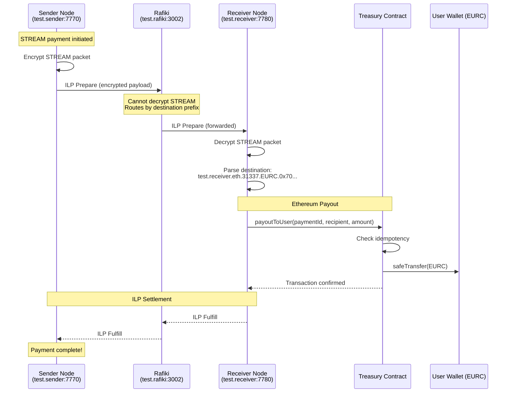

# ILP -> Ethereum Payout/On-ramp POC

**STREAM End-to-End | Rafiki Routing | Prefunded Treasury**

This proof-of-concept demonstrates:

> A STREAM payment sent from an interledger-rs sender node can route through Rafiki and terminate at an interledger-rs receiver node, which executes an ERC-20 payout on-chain via a pre-funded Treasury contract.

- ILP routing works across multiple connectors (Sender → Rafiki → Receiver)
- STREAM encryption is end-to-end (Rafiki only forwards packets)
- Ethereum can act as a ledger behind ILP
- Users receive guaranteed on-chain funds using a prefunded Treasury

## Flow

| Node | Role |
|------|------|
| Sender Node | Encrypts + Sends STREAM packets |
| Rafiki | Forwards ILP packets (cannot decrypt) |
| Receiver Node | Decrypts STREAM and triggers Ethereum payout |

## Components

### 1. Sender Node (interledger-rs)
- **ILP Address**: `test.sender`
- **Port**: 7770
- **Role**: STREAM sender
- **Redis**: localhost:6379

### 2. Rafiki (Cloud Nine Localenv)
- **ILP Address**: `test.rafiki`
- **Port**: 3002
- **Role**: Routes ILP packets between sender and receiver
- **Config**: `rafiki/localenv/cloud-nine-wallet/seed.poc.yml`

### 3. Receiver Node (interledger-rs + ethereum-payout)
- **ILP Address**: `test.receiver`
- **Port**: 7780
- **Role**: STREAM receiver + Ethereum payout
- **Redis**: localhost:6380
- **Destination Format**: `test.receiver.eth.{chainId}.{asset}.{recipient}`

### 4. Smart Contracts (Foundry/Anvil)
- **MockEURC**: ERC-20 token (6 decimals)
- **Treasury**: Prefunded vault with idempotent payouts

## Quick Start

### Prerequisites

- Rust (stable)
- Node.js 18+ and pnpm
- Docker
- Foundry (`curl -L https://foundry.paradigm.xyz | bash && foundryup`)

### Step 1: Start Infrastructure (Anvil + Contracts)

```bash
./scripts/start-poc-infra.sh
```

### Step 2: Start Rafiki

```bash
cd rafiki
pnpm install
git submodule update --init open-payments-specifications
pnpm localenv:compose:poc up -d
```

### Step 3: Start Sender Node (Terminal 1)

```bash
./scripts/start-sender-node.sh
```

### Step 4: Start Receiver Node (Terminal 2)

```bash
./scripts/start-receiver-node.sh
```

### Step 5: Configure Both Nodes (Terminal 3)

```bash
./scripts/configure-sender-node.sh
./scripts/configure-receiver-node.sh
```

### Step 6: Send Payment

```bash
./scripts/send-stream-payment.sh 1000000 0x70997970C51812dc3A010C7d01b50e0d17dc79C8
```

### Step 7: Verify Payment

```bash
# Check recipient EURC balance
cd contracts
cast call $(cat addresses.json | jq -r '.eurc') "balanceOf(address)" 0x70997970C51812dc3A010C7d01b50e0d17dc79C8 --rpc-url http://localhost:8545
```

Or add the network to MetaMask:
- **RPC URL**: `http://127.0.0.1:8545`
- **Chain ID**: `31337`
- **Seed Phrase**: `test test test test test test test test test test test junk`
- **Token Address**: See `contracts/addresses.json` for EURC address

### Stopping Everything

```bash
# Stop nodes (Ctrl+C in their terminals)

# Stop Rafiki
cd rafiki && pnpm localenv:compose:poc down && cd ..

# Stop infrastructure
./scripts/stop-poc-infra.sh
```

## Payment Flow



## Future Vision

This POC establishes the foundation for:

1. **Open Payments Integration**: Add Open Payments above the Ethereum payout
2. **Trustless Delivery**: Treasury prefunding enables guaranteed delivery and makes blockchain people happy about the "trustless" environment
3. **Decentralized Operators**: Multiple operators for Treasury payouts
4. **Multi-Chain Support**: The destination format supports different chains